# Tough Glove Gym


> [Live Site](https://tough-glove-b997cae2826b.herokuapp.com/)

> [Repository](https://github.com/BOM-98/tough-glove-project-4)

# Project Background

## Overview

Tough glove has been created for a boxing gym owner who needs a way to present his gym to the world so he can acquire new members. Tough glove is also a system through which members can create an account, see what classes are available and book classes.

Tough glove is based in Dublin, Ireland and is separating itself from other boxing gyms in Ireland by fulfilling an unmet need in people who want to improve their fitness through boxing classes, while also picking up key boxing skills and principles. 

The market in Dublin has a segment of people - typically males between 18 - 50 - who do not want to competitively compete in boxing, but still want to learn the fundamental skills of the sport. Typical boxing gyms either serve as full-fledged amateur boxing gyms that prepare athletes for bouts, or ‘box-fit’ gyms that emphasise fitness over teaching sound boxing principles. 

Members want to join a gym where they can improve their fitness, but also learn how to handle themselves appropriately in the ring and ensure they don’t pick up ‘bad habits’ typically seen when people work out in boxfit classes. The goal in boxfit classes is typically to tire out members and keep their heart rate up.

## Problem Statement

Your client is a new boxing club based in Dublin 6, Ireland. The owner is in need of a way to have members book classes (both 1:1 classes and group classes) and keep track of who is attending.

The manager also needs this website to be a marketing channel for his new gym and acquire new members. Therefore he needs to be able to communicate what differentiates his classes from other boxing gyms. This would involve a website that has a strong landing page to convert website visitors. The website needs to convey the value proposition of a high-paced boxing class that places equal value on good fundamental boxing skill building.

## Research: 

- User Interviews: 1:1 interviews were conducted with existing gym members, and also potential new gym members, to determine what goals they have and what messaging and value propositions appeal to them. 
- Competitive Analysis: Examining competing boxing gym classes and websites revealed existing offerings and their strengths and weaknesses. This informed our choice of target market, value proposition, messaging and strategy.
- User Testing: Usability testing of existing flows were carried out with existing gym members to examine how they navigate the system and competitor solutions (Glofox & Squarespace)

## Design

- I began the process by designing wire-frames of the site in order to get an overall understanding of the user flows and necessary pages to achieve the client outcomes.
- I converted the wire-frames into [a figma prototype](https://www.figma.com/proto/9gEj83rMB6EfxZzyMkmk81/Tough-Glove-Medium-Fidelity-Design?page-id=0%3A1&type=design&node-id=501-39&viewport=290%2C3902%2C0.52&t=QolXKX1XZCvxny5F-1&scaling=scale-down-width) to determine the flow, color schemes and typography that would be used.
- These prototypes were shared with the gym owner who gave some initial feedback to ensure it achieved their objectives. The messaging and branding was accepted by the owners. I confirmed that the business objectives were met with the figma prototype. 
- The design was then tested with current gym members to ensure they understood the proposition and were able to navigate the prototype without confusion.
- The logo, typeface and colour scheme were chosen to reflect the Tough Glove gym ethos of challenging oneself, respect for the science of boxing and professionalism.

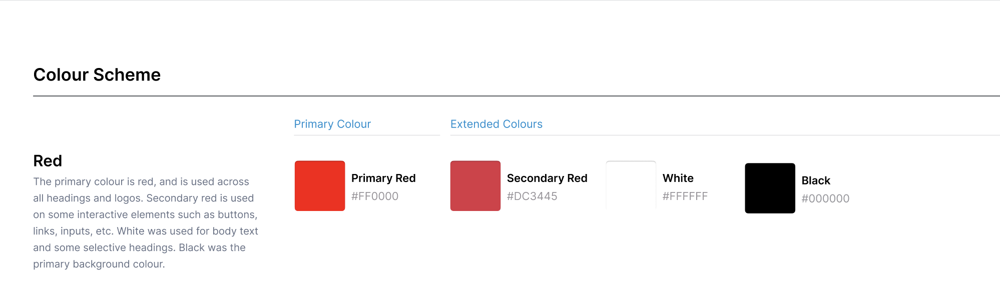


## Agile Development

Agile software development methods were used to deliver this project and ensure that an iterative approach was taken to achieve the best results for the end-user. 
- The project was broken down from the high level business outcomes and problem statement into epics and user stories. 
- The end user's requirements were written from the end user's perspective to help make sure the right features were being built in a user-centric way.

A github projects board was used to track and manage the expected workload involved in this project, and break it down into a list of epics, and then further into user stories that could be worked towards to build the site on time.
- Each user story was written with a clear description following the convention of "As a ____, I want to ______, so that ____".
- A points system was used to estimate the effort involved with each story.
- The end user goal and end business goal was clearly articulated on each story, along with the acceptance criteria. 
- Each story contained the necessary tasks required to complete them and achieve the acceptance criteria. 
- #### [Link to the GitHub Project board](https://github.com/users/BOM-98/projects/4/views/1)


User stories were prioritized using the MoSCow method (Must have, Should have, Could have, Won't have)
- #### [Link to the MoSCow Prioritization Board](https://github.com/users/BOM-98/projects/4/views/3)

Some user stories relating to a blog section for the website were deemed to not be necessary and therefore were not added to the project. This could be added to the project on a future date as Tough Glove continue to grow.

## Data Models

The database schema for the tough glove site is shown below:

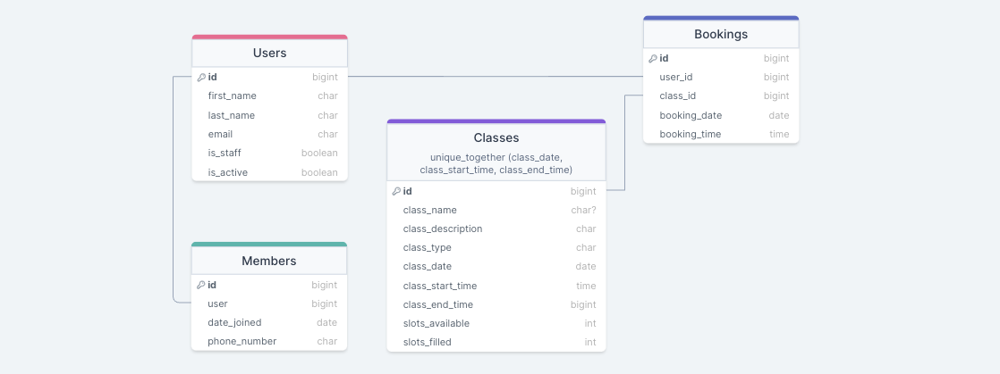


- `User` - represents a user in the tough glove gym. This is the default model provided in the Django framework. Admin users are differentiated from gym members by the groups they are added to. 
- `Members` - represents additional information for each member in the gym, such as their phone number and date joined.
- `Classes` - represents Classes that the gym admin creates for the gym.
- `Bookings` - represents class bookings that members of the gym make to reserve their spot in each class.

Database Relationships:
- `Users` have a one to one relationship with `Members`
- `Users` have a one to many relationship with `Bookings`
- `Classes` have a one to many relationship with `Bookings`

# Features

## CRUD functionality:

### Member CRUD Functionality
- Create:
  - Users can create a `User` with an associated `Member` on the register page
  - Users can create a `Bookings` for a class through the BookingForm
- Read: 
  - Users can read their `User` information on their profile page
  - Users can read all of the `Classes` that are available in the classes page
  - Users can read their `Bookings` they have created in the user bookings page
- Update: 
  - Users can update the `User` account with the update_member page and form
- Delete:
  - Users can delete their `Bookings` in their cancel_bookings page
### Admin CRUD Functionality
- Create:
  - Admins can create new `Users` other than themselves with admin privileges using the CreateUserForm
  - Admins can create `Classes` through the create_class page
  - Admins can create `Bookings` for themselves
- Read: 
  - Admins can read all of the `Users` that are currently in the gym from the admin dashboard and the members page
  - Admins can read all of the `Classes` that are currently running from the admin dashboard and the classes page. Classes are also displayed on calendars on both pages
- Update: 
  - Admins can update `Users` on the site, changing all of their details including first_name, last_name and email
  - Admins can update `Classes` by via the UpdateClassForm on the update class page
- Delete:
  - Admins can delete `Users` and the associated `Members` data on the site if they need to remove members
  - Admins can delete `Classes` from the site
  - Admins can delete `Bookings` that are their own, but not other user's bookings. 


## Authentication / Authorization:

Certain access restrictions were put in place across the website. 

### No Login Required

- Homepage is viewable by everyone 

### Must Be Logged Out To View

Only users who are not logged in can view:
- The registration page to register an account
- The login page to login to their account

If a user is logged in and navigates to these pages they should be redirected to the available classes page


### Login Required:

Logins are required on a user account in order to access these pages:
- Available classes page
- Members page
- Profile page (only their own profile)
- Update Member page (only their own)
- Classes Page
- User Bookings Page (only their own)
- Book Class Page
- Cancel Bookings Page


### Admin Only Access: 

Only users logged in with an admin account can access these pages:

- Profile page (Profiles other than their own)
- Update Member page (can update everyone)
- Delete member page
- Admin dashboard page
- Create Class Page
- Update Class Page
- Delete Class Page
- User Bookings Page (only their own)
- Create User Page (Admin - can create multiple accounts from the admin dashboard)

## General Features: 

### Navigation & Footer

- A primary navigation is present on the header on all pages of the website.

- <b>If a user is logged in as an admin, the user has access to all available navigation links</b>

<details>
<summary>Screenshot of Admin Navigation</summary>


</details>
<br>

- If the user is logged in as a member, the user has access to the classes, my booking and profile links

<details>
<summary>Screenshot of Member Navigation</summary>


</details>
<br>

- If the user is not logged in, the navigation displays the register and login links
<details>
<summary>Screenshot of Logged Out Navigation</summary>


</details>
<br>

- The navigation collapses into a burger menu on mobile screens
<details>
<summary>Screenshot of Collapse Menu</summary>


</details>
<br>

The footer is present on all screens of the website and follows the same conditional login for presenting links as the primary navigation

### Homepage

The homepage acts as an advertising front for any visitors who are not currently members. The copy on the homepage will be optimised for SEO keywords to win search traffic from people searching for boxing gyms in Dublin.

<details>
<summary>Screenshots of The Homepage</summary>


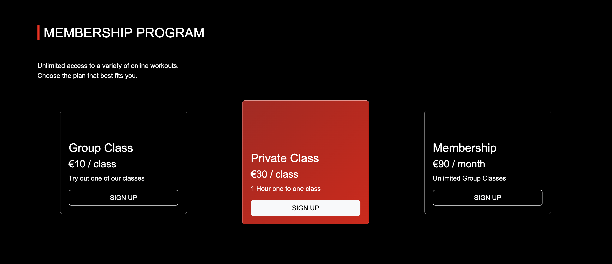
</details>

### Login & Register

Login and register pages were implemented to manage user access to class schedules and secure contact information within the gym management system

The gym owner collects `first name`, `last name` and `email` for marketing purposes through the registration form. 

Form validation ensures that no username can be used twice. The gym owner requested that people can create multiple accounts with the same email so that field was not restricted as a unique field.

<details>
<summary>Screenshot of The Register Form</summary>

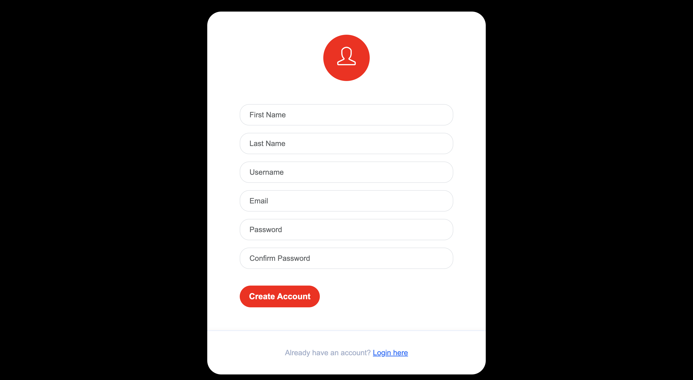

</details>
<br>
<details>
<summary>Screenshot of The Login Form</summary>

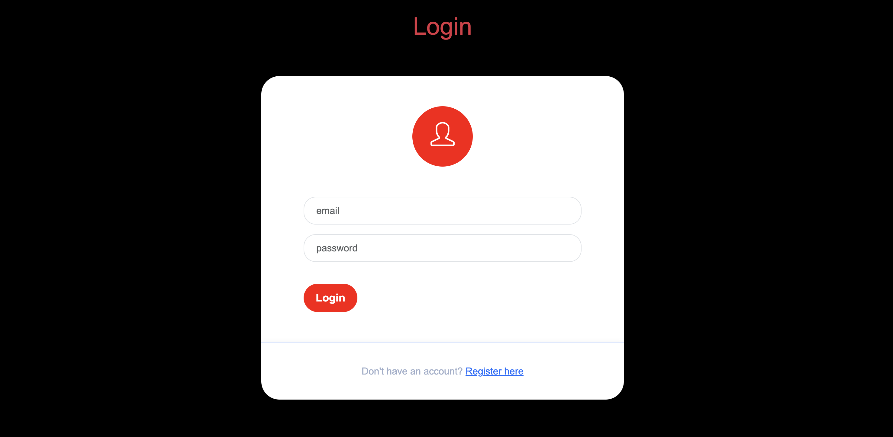

</details>

### Error Pages

Custom error pages were added to handle 400, 403, 404 and 500 errors. 

<details>
<summary>Screenshot of The 404 Page</summary>

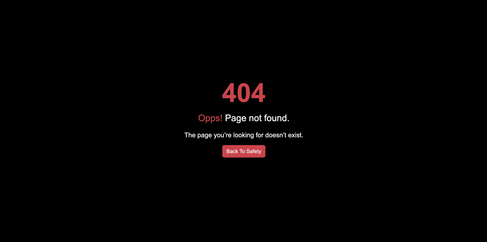

</details>

## Admin Features: 

### Admin Dashboard

An admin dashboard is used for the gym owner to manage classes and members. A the dashboard reads the database to display high level overview of total members and classes is shown, with a breakdown of which classes are pt classes and which classes are group classes. The admin can then create, update and delete classes and members from here. 

<details>
<summary>Screenshots of The Admin Dashboard</summary>

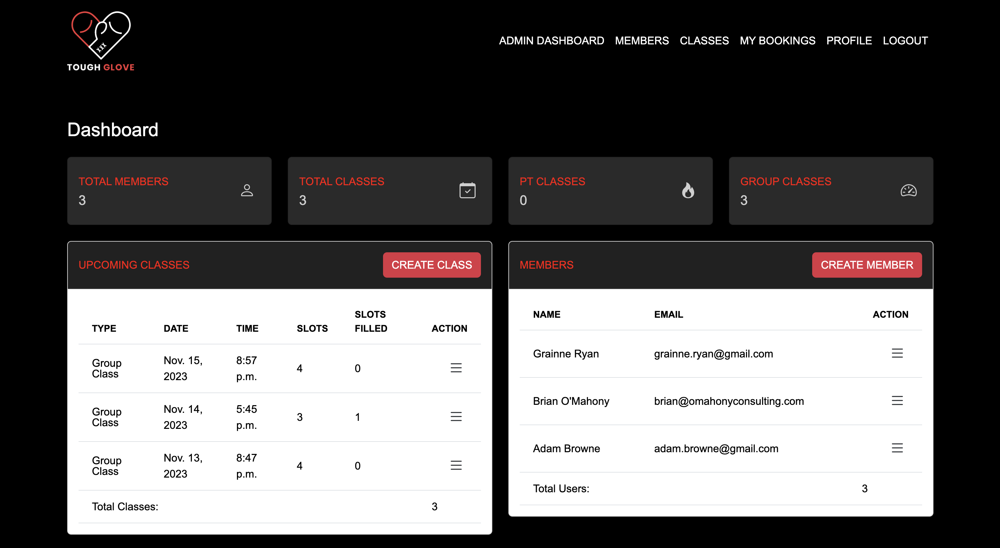
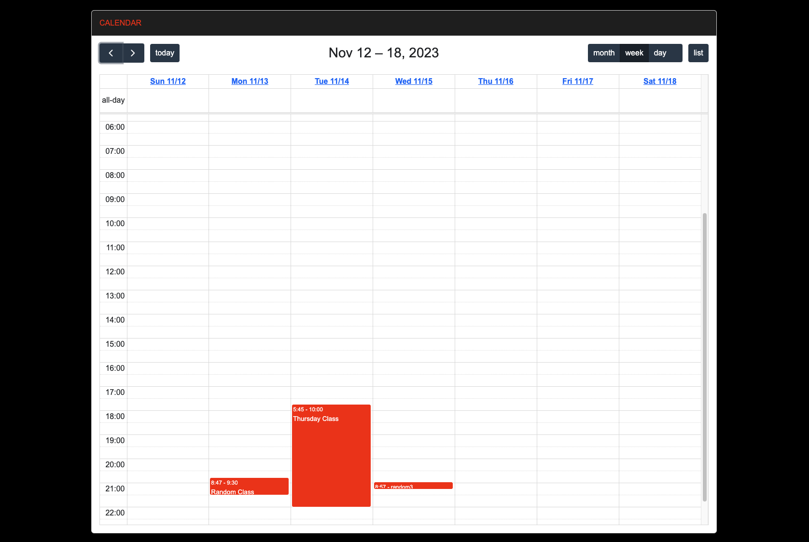

</details>


### Members Listings

A members management page is used for the gym owner to manage members specifically in more detail. The dashboard reads the database to display a more detailed view of the `first_name`, `last_name`, `email`, `username`, `phone` and `date_joined` fields of the `Members` model. The admin can update and delete members under the actions column of the table and can also create new users from here. Only gym admins can view this page. 

<details>
<summary>Screenshot of The Members Page</summary>

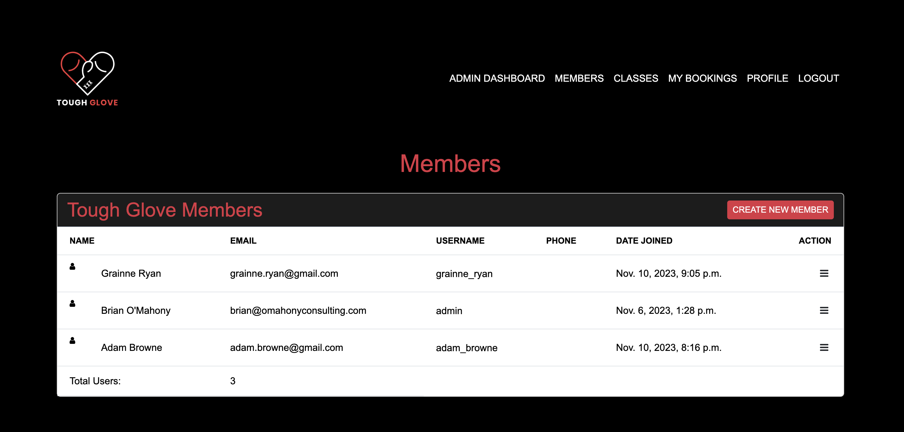

</details>


## Members Features: 

Members have pages they can view to browse available classes and book classes they want to attend. Members can also manage their bookings from there and view their profile details. 

### Classes Page

A class management page is used for the gym owner to manage classes specifically in more detail. The dashboard reads the database to display a more detailed view of the `class_name`, `class_type`, `class_date`, `class_start_time`, `slots_available` and `slots_filled` of the `Classes` model. Another calendar is available for easier visual reference. Slots available and slots filled dynamically update as classes are booked by members. The admin can update, delete and book classes from this page. The gym owner requested the ability to book classes himself in case he wanted to reserve spots for people who had not registered yet. Only admins can view this page.

NOTE: members can only see classes and book them. They do not see the update or create class buttons. 

<details>
<summary>Screenshot of The Classes Dashboard</summary>

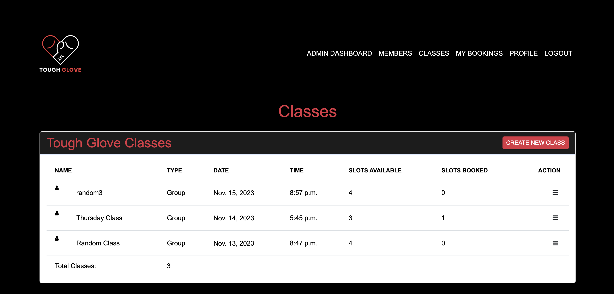

</details>

### Bookings Page

Members can see a list of all of the bookings they have made on the bookings page. This allows them to cancel bookings if they need to also. 

<details>
<summary>Screenshot of The Classes Dashboard</summary>

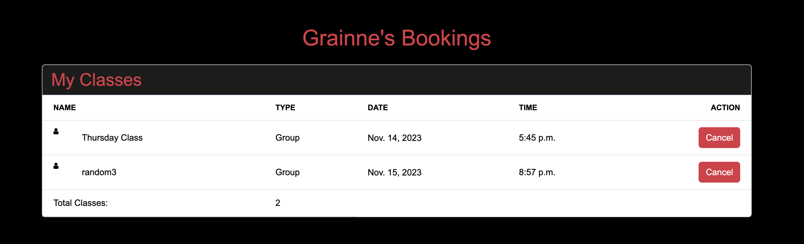

</details>

### Profile View & Update Pages

Members can view their profile details and update them in the profile section.

<details>
<summary>Screenshot of The Profile Page</summary>

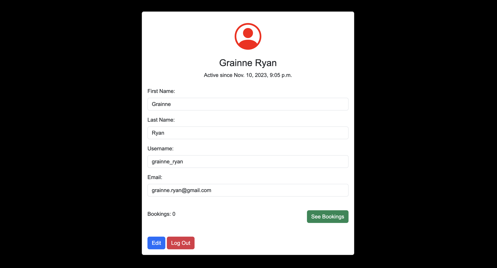

</details>


## Roadmap

### Social Media Logins

It is intended to add functionality to allow members register and login using social media authentication from google and meta. This would significantly reduce the friction on sign-up for new members and improve the conversion rate of web visitors to members. 

### Google Calendar Integration

It is intended to add calendar events to the personal calendars of members of the gyms when they book classes. This would help remind members of upcoming classes and has built in functionality to remind members when classes are upcoming. 

### Google Maps Integrations

Tough Glove is moving to a new gym address. Once that address is secured I will be adding a location for the gym to the site. This will help Tough Glove to rank higher on local SEO and inform interested web visitors where the gym is. 

### Implement A Blog 

Tough Glove wants to stand out as a voice of authority in Dublin on the topic of boxing training. Informational blog posts will add an element of credibility to the company and also help Tough Glove rank higher on Google/Bing for targeted keywords. 

### Implement Recurring Classes & Archive Finished Classes

Currently the gym owners are only able to schedule one off classes. I want to add functionality to allow the gym owner to schedule recurring classes that repeat for 28 days from the current date. Classes that have already occurred are still displayed on the admin dashboard and classes page. I want to archive finished classes as they are no longer relevant and should not be taking up space on the site. 

### Alerts If Two Classes Are Made At The Same Time

The gym owner wanted to maintain the ability to schedule two classes at the same time in case two different trainers were taking different classes. However, I intend to add an alert that notifies the admin if this is happening as they are creating the second class to avoid situations were this may still be done unintentionally. I have however added a constraint so that two classes can't have the same date, start time AND end time to demonstrate the capability to restrict on the server side classes made with the exact same information. 

### Password Reset

Currently members can't reset their passwords in case they forget them. I will need to add a password reset option for the admin and members that sends verification emails to their registered email address. 

# Bugs

## Bug 1: Cancel buttons posting to the Database

I implemented cancel buttons on forms across the site in case any users wanted to abandon a form e.g. booking a class. I noticed that when I pressed the cancel button the form was still submitting a post request to the database and creating an instance of a booking for the user. I could not get around this for a while without placing the cancel button outside of the form, which resulted in a weird UI layout. I attempted using Javascript to get around this issue following [this resource](http://johnharbison.net/make-a-form-a-cancel-button).  When a user canceled a booking it still created a booking on their account for that Class. To resolve this issue, I had to implement logic on the views for the bookings that specifically redirected the user if "cancel" was in the post request. [This stack overflow page](https://stackoverflow.com/questions/17678689/how-to-add-a-cancel-button-to-deleteview-in-django) was helpful in implementing this approach. 

```
if "cancel" in request.POST:
                return redirect('classes')
```


## Bug 2: Deleting bookings wasn’t decrementing the class slots

When a user books a class these is logic in the view that increments the `slots_filled` field and decrements the `slots_available` field. I noticed that when a user canceled a booking the `slots_filled` and `slots_available` fields for the Classes model were still stuck on the previous setting. 

To resolve this issue, I used Django signals following [Django's documentation](https://docs.djangoproject.com/en/4.2/topics/signals/) to check any time a user or an admin deleted a booking and used them to adjust the `slots_available` and `slots_filled` for the respective class appropriately. The following code was used: 

```
models.py:

@receiver(post_delete, sender=Bookings)
def decrement_slots(sender, instance, **kwargs):
    """
    Signal handler to decrement the number of filled slots and increment the 
    number of available slots for a class when a booking is deleted.

    Args:
        sender (Model): The model class that sent the signal.
        instance (Bookings): The instance of the Bookings model being deleted.
        **kwargs: Additional keyword arguments provided by the signal.

    Returns:
        None
    """
    class_instance = instance.class_id
    class_instance.slots_available += 1
    class_instance.slots_filled -= 1
    class_instance.save()
```

## Bug 3: Deleting bookings wasn’t decrementing the class slots

At one point I tried changing `bootstrap-datetime-picker` for `django-scheduler` to create my events on the calendar in my app. Halfway through this transition I realised that `django-scheduler` was not suitable for the tasks I needed it to perform - however I had already run migrations on the new models that django-scheduler had needed. I reverted back to a previous commit to undo all of the changes I had implemented. Doing this AFTER I had run the migrations caused issues, as now the program was trying to reference tables that no longer existed since I had uninstalled `django-scheduler`. Errors kept emerging when I tried to run the program. The resolve this issue - I got the help of tutor support to assist me in resetting my databases.To reset the database I had to delete all of the files in my migrations folder except for the `__init__.py` file. Once this was done I ran my migrations again from the beginning and all of my tables and fields were recreated from scratch. 

## Bug 4: Django testing was not allowed to create new tables in elephant sql

When running my tests for my program I was getting errors as my test suite did not have permission to create tables in elephant sql. To resolve this issue, I had to change my settings to instruct the program to use the default sqlite3 backend for running the tests.

```
DATABASES = {
    'default': dj_database_url.parse(os.environ.get("DATABASE_URL"))
}

if 'test' in sys.argv:
    DATABASES = {
        'default': {
            'ENGINE': 'django.db.backends.sqlite3',
            'NAME': 'mydatabase',
        }
    }
```

## Bug 5: Unable to remove secret urls and keys from .env file accidentally committed at the beginning of the project

I forgot to add my .env file to the .gitignore at the beginning of the project, which resulted in the secret keys accidentally being pushed to github. I removed this file later on, but realised that the .env file is still visible in the first 7 commits in the repository, meaning someone could see them if they searched through the commit history. 

To solve this issue, I attempted to rebase my commits from the 8th commit onwards. However, due to the migrations files created by django every time the database is migrated each commit was throwing an error in the rebasing program. The files need to reference the ones that came immediately before it meaning that when they are no longer in the commit history it resulted in errors. 

I additionally attempted to change out the secret keys in the .env files so that they no longer were needed. I created a new database in elephant SQL but when I tried to swap the elephant sql url and ran the migrations it created errors in my program every time I tried to post something to the database. I had to revert back to the original url as a result.

With the help of tutor support I was able to rotate my keys for my database and Cloudinary url and change my secret keys. Tutor support showed me how to rotate the keys, which was a different approach to what I was taking with creating a new database in elephantSQL. All keys and urls have now been changed and are no longer problematic security issues. 

# Technologies Used

I outline the different technologies involved in this project and the purpose for using each technology in this section.

## Core Technologies

- [Django](https://www.djangoproject.com/) the full stack framework used for this gym management system.
- [JavaScript](https://www.ecma-international.org/publications-and-standards/standards/ecma-262/) used for rendering the fullcalendar calendar in the app.
- [HTML](https://html.spec.whatwg.org/)/[CSS](https://www.w3.org/Style/CSS/Overview.en.html) + [Django Template Language](https://docs.djangoproject.com/en/4.2/ref/templates/language/) used for building templates on the website and rendering data from the database on the webpages.

## Frameworks and Packages


- [Bootstrap 5](https://getbootstrap.com/) - CSS library used to style the site and implement pre-built components.
- [Bootstrap Icons](https://icons.getbootstrap.com/) - Icon library used for svg icons throughout the site.
- [Fullcalendar](https://fullcalendar.io/) - A javascript calendar used for displaying events on web apps.


## Django Packages

- [Gunicorn](https://pypi.org/project/gunicorn/) - provides HTTP server.
- [psycopg2](https://pypi.org/project/psycopg2/) - provides PostgreSQL connection.
- [Whitenoise](https://pypi.org/project/whitenoise/) - used for serving static files.
- [Coverage](https://pypi.org/project/coverage/) - used for testing and analysis.
- [django-bootstrap-datepicker-plus](https://django-bootstrap-datepicker-plus.readthedocs.io/en/latest/Usage.html) - datepicker plugin used for selecting times and dates for classes being made. 
- [Black](https://pypi.org/project/black/) - A PEP8 compliant code formatter.


## Deployment Technologies

- [PostgreSQL](https://www.postgresql.org/) (via Elephant SQl) - used for database.
- [Heroku](https://www.heroku.com/) - used for hosting the application.
- [Cloudinary](https://cloudinary.com/) - Image API platform for delivering images via CDN.
- [Github](https://github.com/) - code repository for storing the codebase and version control

# Testing

## Automatic Testing

Automatic unit tests were written for the Layout back-end functionality of the app to test all of the templates, forms, models and views of the site.

- 54 Unit Tests were written in total

### Form Tests

- All forms were tested in `test_forms.py` for appropriate form validation and to ensure the integrity of all of the data written to the database.

<details>
<summary>List of Form Unit Tests</summary>

 Test      | Result |
| ----------- | ----------- |
| CREATEUSERFORM is valid if no fields are excluded     | OK      |
| CREATEUSERFORM is invalid if no FIRST_NAME field is inputted   | OK       |
| CREATEUSERFORM is invalid if no USERNAME field is inputted   | OK       |
| CREATEUSERFORM is invalid if no EMAIL field is inputted   | OK       |
| CREATEUSERFORM is invalid if a duplicate USERNAME field is inputted  | OK       |
| CREATEUSERFORM is valid if a duplicate EMAIL field is inputted  | OK       |
| CREATEUSERFORM is invalid if the PASSWORD1 and PASSWORD2 fields are different  | OK       |
| UPDATEUSERFORM is valid if no fields are excluded  | OK       |
| UPDATEUSERFORM is invalid if no FIRST_NAME field is inputted  | OK       |
| UPDATEUSERFORM is invalid if no LAST_NAME field is inputted  | OK       |
| UPDATEUSERFORM is invalid if no USERNAME field is inputted  | OK       |
| UPDATEUSERFORM is invalid if no EMAIL field is inputted  | OK       |
| CREATECLASSFORM is valid if no fields are excluded  | OK       |
| CREATECLASSFORM is invalid if no CLASS_TYPE field is inputted  | OK       |
| CREATECLASSFORM is invalid if no CLASS_DATE field is inputted.  | OK       |
| CREATECLASSFORM is invalid if no CLASS_START_TIME field is inputted  | OK       |
| CREATECLASSFORM is invalid if no CLASS_END_TIME field is inputted  | OK       |
| CREATECLASSFORM is invalid if no SLOTS_AVAILABLE field is inputted  | OK       |
| UPDATECLASSFORM is valid if no fields are excluded  | OK       |
| BOOKINGFORM is valid if no fields are excluded  | OK       |
| BOOKINGFORM is invalid if no USER field is inputted  | OK       |
| BOOKINGFORM is invalid if no CLASS_ID field is inputted  | OK       |
| CREATECLASSFORM is invalid if no SLOTS_AVAILABLE field is inputted  | OK       |
</details>

<br>

### Models Tests

- Models are tested in `test_models.py` to check that models created the correct instances in the system


#### Class Model Tests:

<details>
<summary>Class Model Unit Tests</summary>

| Test Description                                | Action                                                               | Expected Outcome       |
| ----------------------------------------------- | -------------------------------------------------------------------- | ---------------------- |
| Test Class Creation                             | Verify the class instance has correct initial settings.              |                        |
| \- `class_name` is 'Test Class'                 | Check the `class_name` attribute.                                    | Pass                   |
| \- `slots_available` is set to 10               | Check the `slots_available` attribute.                               | Pass                   |
| \- `slots_filled` starts at 0                   | Check the `slots_filled` attribute.                                  | Pass                   |
| Unique Together Constraint                      | Ensure class uniqueness based on date and time.                      |                        |
| \- Attempt to create a duplicate class instance | Try creating a class with the same date and time as an existing one. | Exception raised, pass |

</details>

<br>

#### Booking Model Tests:

<details>
<summary>Booking Model Unit Tests</summary>

| Test Description                            | Action                                                       | Expected Outcome |
| ------------------------------------------- | ------------------------------------------------------------ | ---------------- |
| Test Booking Creation                       | Verify the booking instance is correctly created and linked. |                  |
| \- `user` is linked to `other_user`         | Check the `user` attribute.                                  | Pass             |
| \- `class_id` is linked to `class_instance` | Check the `class_id` attribute.                              | Pass             |

</details>

<br>

#### Class Slot Management Tests:

<details>
<summary>Slot Management Unit Tests</summary>

| Test Description                                        | Action                                                     | Expected Outcome |
| ------------------------------------------------------- | ---------------------------------------------------------- | ---------------- |
| Test Decrement Slots                                    | Validate the update of slot availability and filled slots. |                  | Pass
| \- After booking deletion, `slots_available` increments | Delete a booking and check `slots_available`.              | Pass             |
| \- After booking deletion, `slots_filled` decrements    | Delete a booking and check `slots_filled`.                 | Pass             |Pass             | 

</details>

<br>

### Views Tests

- Views are tested in `test_views.py` to ensure HTTP status codes, templates used and forms all performed as expected. 

#### Registration and Login Tests:

<details>
<summary>Registration and Login Unit Tests</summary>

| Test Case         | Description                                                                                 | Outcome |
| ----------------- | ------------------------------------------------------------------------------------------- | ------- |
| Homepage View     | Confirms that the homepage view uses the correct template and returns a status code of 200. | Pass    |
| Register View     | Checks the registration page is displayed correctly with the appropriate template.          | Pass    |
| User Registration | Ensures that a new user can register successfully and is redirected to the login page.      | Pass    |
| Login View        | Validates the login page is displayed correctly with the appropriate template.              | Pass    |
| User Login        | Confirms that a user can log in successfully and is redirected to the homepage.             | Pass    |
</details>
<br>

#### Member Views Tests:

<details>
<summary>Member Views Unit Tests</summary>

| Test Case                   | Description                                                                             | Outcome |
| --------------------------- | --------------------------------------------------------------------------------------- | ------- |
| Logout View                 | Tests if a user can logout successfully and is redirected to the homepage.              | Pass    |
| Available Classes View      | Ensures that the list of available classes is retrieved successfully.                   | Pass    |
| Profile View                | Checks that the user profile page is displayed correctly and uses the correct template. | Pass    |
| Update Member View          | Confirms that the member update page is accessible and uses the correct template.       | Pass    |
| Update Profile              | Ensures that a user can update their profile and is redirected to the profile page.     | Pass    |
| Unauthorized Profile Update | Verifies that a user cannot update another user's profile unless they are an admin.     | Pass    | Pass    |
</details>
<br>

#### Admin Views Tests:

<details>
<summary>Admin Views Unit Tests</summary>

| Test Case            | Description                                                                     | Outcome |
| -------------------- | ------------------------------------------------------------------------------- | ------- |
| Members View         | Tests if the admin can view the list of members.                                | Pass    |
| Update Other Profile | Checks that an admin can update other member profiles.                          | Pass    |
| Delete Member View   | Confirms that the admin can access the delete member page.                      | Pass    |
| Delete Profile       | Ensures that an admin can delete a member's profile.                            | Pass    |
| Admin Dashboard View | Validates that the admin dashboard is accessible and uses the correct template. | Pass    |
</details>
<br>

#### Classes Views Tests:

<details>
<summary>Classes Views Unit Tests</summary>

| Test Case         | Description                                                               | Outcome |
| ----------------- | ------------------------------------------------------------------------- | ------- |
| Create Class View | Confirms that the class creation page is displayed correctly.             | Pass    |
| Create Class      | Ensures that an admin can create a class successfully.                    | Pass    |
| Update Class View | Checks that the class update page is displayed correctly.                 | Pass    |
| Update Class      | Verifies that an admin can update class details.                          | Pass    |
| Delete Class View | Tests if the class deletion page is displayed correctly.                  | Pass    |
| Delete Class      | Confirms that an admin can delete a class.                                | Pass    |
| Classes View      | Ensures that the classes list page is accessible and displayed correctly. | Pass    |
</details>
<br>

#### Bookings Views Tests:

<details>
<summary>Bookings Views Unit Tests</summary>

| Test Case           | Description                                                                   | Outcome |
| ------------------- | ----------------------------------------------------------------------------- | ------- |
| Bookings View       | Validates that the bookings page is accessible and uses the correct template. | Pass    |
| Book Class View     | Checks that the class booking page is displayed correctly.                    | Pass    |
| Book Class          | Confirms that a user can book a class successfully.                           | Pass    |
| Cancel Booking View | Tests if the cancel booking page is displayed correctly.                      | Pass    |
| Cancel Booking      | Ensures that a user can cancel a booking successfully.                        | Pass    |
</details>
<br>

### Automated Test Results: 

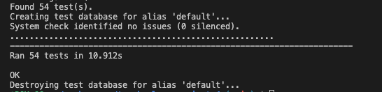

### Coverage Report: 

Overall I managed to gain 94% coverage on my layout app as seen in the image below. 

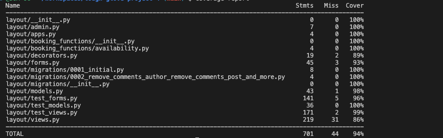

## Manual Testing

### General Tests

| Test                                  | Action                                                                                       | Result |
| ------------------------------------- | -------------------------------------------------------------------------------------------- | ------ |
| URL loads                             | Enter the website URL into a browser and press Enter.                                        | PASS   |
| Page loads in under 3 seconds         | Measure the load time of the page from the moment the URL is entered.                        | PASS   |
| Navigation links all work             | Click each navigation link in the header and verify it directs to the correct page.          | PASS   |
| All CTA Links work                    | Click each Call to Action (CTA) link and verify it performs the expected action.             | PASS   |
| All footer navigation links work      | Click each navigation link in the footer and verify it directs to the correct page.          | PASS   |
| Social link opens to a different page | Click each social media link and verify it opens the correct social media page in a new tab. | PASS   |

### Homepage Testing

| Test                                  | Action                                                                                     | Result |
| ------------------------------------- | ------------------------------------------------------------------------------------------ | ------ |
| Logo link works                       | Click on the website's logo to ensure it redirects to the homepage.                        | PASS   |
| Page loads in under 3 seconds         | Time the page load from when the URL is entered to when the page is fully loaded.          | PASS   |
| Navigation links all work             | Test each navigation link in the site's menu to confirm they lead to the correct pages.    | PASS   |
| All CTA Links work                    | Click on each Call to Action button/link and check it leads to the expected response/page. | PASS   |
| All footer navigation links work      | Verify each link in the footer to ensure they navigate to the correct sections or pages.   | PASS   |
| Social link opens to a different page | Click the social media icons and check if they open the correct profiles in new tabs.      | PASS   |

### Login & Register Page Testing

| Forms create a new user                          | Complete and submit the registration form with valid details.                              | PASS |
| ------------------------------------------------ | ------------------------------------------------------------------------------------------ | ---- |
| Form validation prevents missing fields          | Submit forms with some fields left blank to test required field validation.                | PASS |
| Form validation prevents duplicate users         | Attempt to register a user with a username or email that already exists.                   | PASS |
| Password validation prevents easy passwords      | Try to create a user with common passwords to test the strength validation.                | PASS |
| Password confirmation prevents mismatched fields | Enter mismatched passwords in the 'password' and 'confirm password' fields.                | PASS |
| User can login with a valid account              | Attempt to login with correct user credentials.                                            | PASS |
| User can't login with an invalid account         | Attempt to login with incorrect user credentials.                                          | PASS |
| Error messages for invalid forms display         | Submit invalid forms to ensure that appropriate error messages are displayed.              | PASS |
| Login link on register form redirects            | Click the login link on the registration form to ensure it redirects to the login page.    | PASS |
| Register link on login form redirects            | Click the register link on the login form to ensure it redirects to the registration page. | PASS |
| All footer navigation links work                 | Click each navigation link in the footer and verify it directs to the correct page.        | PASS |

### Admin Page Testing

| Test                                                | Action                                                                                                | Result |
| --------------------------------------------------- | ----------------------------------------------------------------------------------------------------- | ------ |
| Create a class link works                           | Click the "Create a Class" link and verify it opens the class creation form.                          | PASS   |
| Create a member link works                          | Click the "Create a Member" link and verify it opens the member creation form.                        | PASS   |
| Class Deletion button deletes class                 | Use the delete button on a class entry and verify the class is removed from the database.             | PASS   |
| User must confirm class deletions                   | Attempt to delete a class and verify that a confirmation prompt is displayed.                         | PASS   |
| Member Deletion button deletes members              | Use the delete button on a member entry and verify the member is removed from the database.           | PASS   |
| User must confirm member deletions                  | Attempt to delete a member and verify that a confirmation prompt is displayed.                        | PASS   |
| Class Update button redirects to update form        | Click the "Update" button for a class and verify redirection to the update form.                      | PASS   |
| Member Update button redirects to update form       | Click the "Update" button for a member and verify redirection to the update form.                     | PASS   |
| Class calendar displays all classes in the database | Verify that the class calendar shows all scheduled classes.                                           | PASS   |
| Class calendar month, week, day and list views work | Test different views (month, week, day, list) in the class calendar to ensure they display correctly. | PASS   |
| Class calendar Renders (JAVASCRIPT TEST) | Load the webpage to ensure the javascript renders the calendar on page load. | PASS   |

### Members Page

| Test                                           | Action                                                                                          | Result |
| ---------------------------------------------- | ----------------------------------------------------------------------------------------------- | ------ |
| Create New Member Link Works                   | Click the "Create New Member" link to ensure it directs to the new member creation form.        | PASS   |
| All User Actions Work                          | Verify that all user actions (update & delete) function as intended.                | PASS   |
| Update User Link Works                         | Click the "Update User" link for a member to check if it redirects to the user update form.     | PASS   |
| Delete User Link Works                         | Use the "Delete User" link or button for a member to confirm it initiates the deletion process. | PASS   |
| Total Users Column Correctly Tallies the Users | Confirm that the "Total Users" column presents an accurate count of all users.                  | PASS   |


### Classes Page

| Test                                          | Action                                                                                                      | Result |
| --------------------------------------------- | ----------------------------------------------------------------------------------------------------------- | ------ |
| Create a Class Button Works                   | Click the "Create a Class" button to ensure it leads to the class creation form.                            | PASS   |
| All Class Actions (Update, Delete, Book) Work | Test each action button for a class to confirm that update, delete, and book operations function correctly. | PASS   |
| Classes Count Correctly Tallies the Classes   | Verify the total count of classes listed matches the actual number of classes in the system.                | PASS   |
| Slots Available Counts the Correct Numbers    | Check that the "Slots Available" count reflects the correct number of available slots per class.            | PASS   |
| Slots Booked Counts the Correct Numbers       | Confirm that the "Slots Booked" count accurately represents the number of slots booked.                     | PASS   |
| Class calendar displays all classes in the database | Verify that the class calendar shows all scheduled classes.                                           | PASS   |
| Class calendar month, week, day and list views work | Test different views (month, week, day, list) in the class calendar to ensure they display correctly. | PASS   |
| Class calendar Renders (JAVASCRIPT TEST) | Load the webpage to ensure the javascript renders the calendar on page load. | PASS   |

### My Bookings

| Test                                      | Action                                                                                        | Result |
| ----------------------------------------- | --------------------------------------------------------------------------------------------- | ------ |
| Correctly Displays Bookings for User      | Check that the user's bookings are correctly displayed on their booking page.                 | PASS   |
| Cancel Button on Bookings Works           | Click the "Cancel" button on a booking to ensure it initiates the cancellation process.       | PASS   |
| Bookings Total Column is Correct          | Verify that the "Bookings Total" column sums up the correct total number of bookings made.    | PASS   |
| Booking Page Title Displays the User Name | Ensure that the booking page title includes the user's name, indicating personalized content. | PASS   |

### Profile

| Test                                       | Action                                                                                               | Result |
| ------------------------------------------ | ---------------------------------------------------------------------------------------------------- | ------ |
| First Name is Correct                      | Verify that the displayed first name matches the user's actual first name.                           | PASS   |
| Last Name is Correct                       | Confirm that the displayed last name matches the user's actual last name.                            | PASS   |
| Username is Correct                        | Check that the displayed username is accurate according to the user's profile data.                  | PASS   |
| Email is Correct                           | Ensure the displayed email address is the one associated with the user's account.                    | PASS   |
| Bookings Count is Correct                  | Confirm that the number displayed in the bookings count reflects the actual number of bookings made. | PASS   |
| See Bookings Link Directs to Bookings Page | Click on the "See Bookings" link and check if it redirects to the user's bookings page.              | PASS   |
| Edit Button Directs to Update User Page    | Use the "Edit" button and verify redirection to the user's profile update page.                      | PASS   |
| Log Out Button Logs the User Out           | Click the "Log Out" button and confirm that it successfully logs the user out of the system.         | PASS   |

## Pagespeed Insights Report

Pagespeed Insights & Lighthouse testing revealed near perfect results for the performance of the website across all dimensions.

<br>

> homepage.html


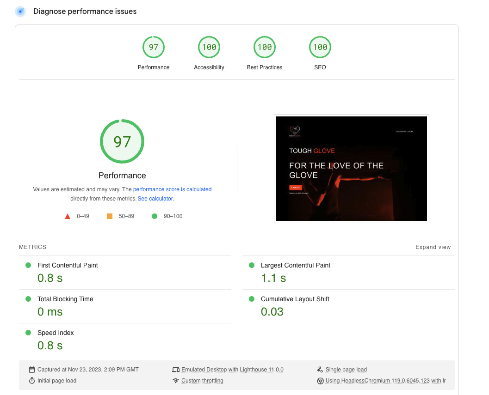

<details>
<summary>Pages Tested List:</summary>

- create_member.html
- delete_member.html
- login.html
- members.html
- profile.html
- register.html
- update_member.html
- book_classes.html
- cancel_booking.html
- classes.html
- delete_class.html
- update_class.html
- user_bookings.html
- admin_dashboard.html
- available_classes.html
- homepage.html
- 400.html
- 403.html
- 404.html
- 500.html

</details>

## Responsiveness Testing

- ResponsivelyApp and Chrome Dev Tools were used to test responsiveness.
- The website underwent comprehensive testing in both portrait and landscape orientations across a variety of simulated mobile, tablet, and large format screen sizes.
- All pages were tested across browsers for full responsiveness. 

<br>
<details>
<summary>Homepage Responsive Checking</summary>

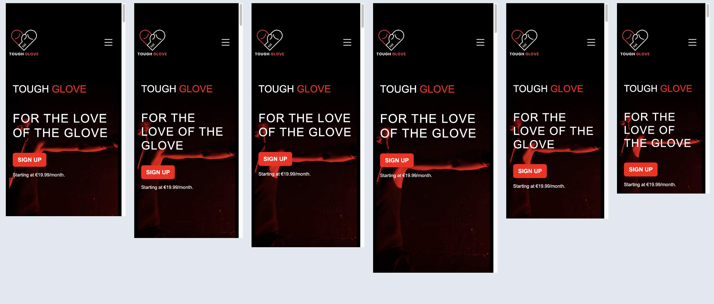
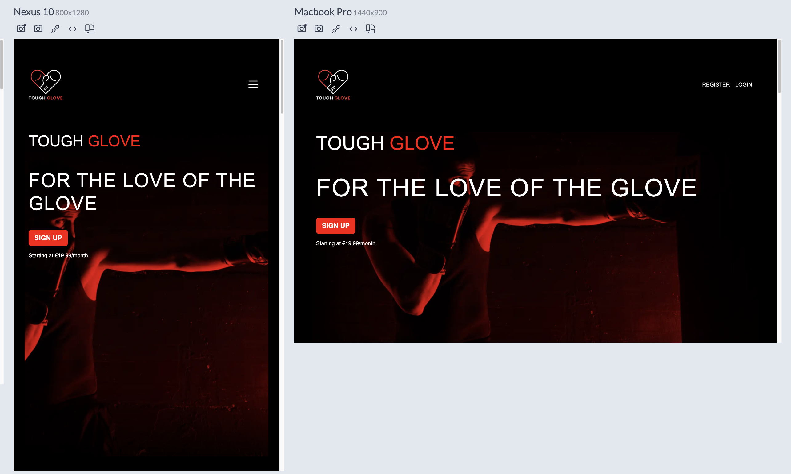

</details>

<br>
<details>
<summary>Admin Responsive Checking</summary>

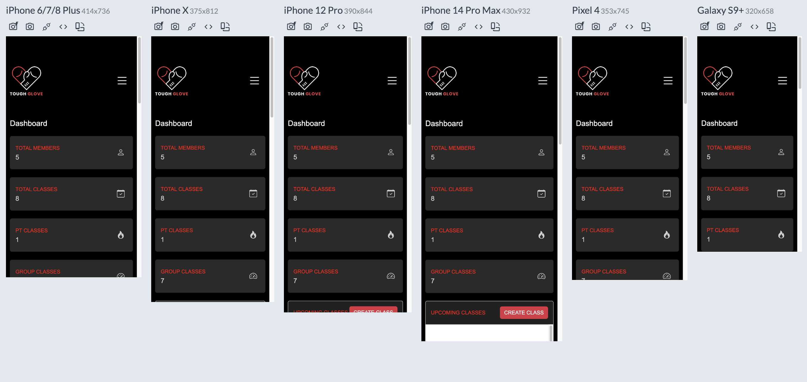
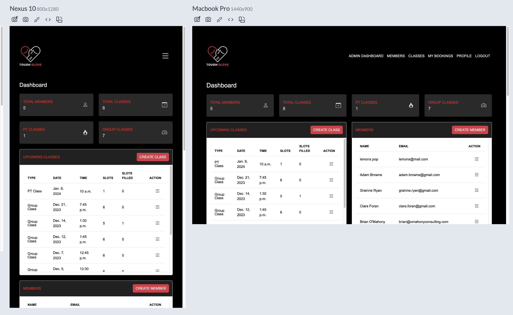

</details>

## Code Validation

### HTML

All HTML code was put through the [W3 HTML Validator](https://validator.w3.org/nu/) and passed.
<br>

> homepage.html
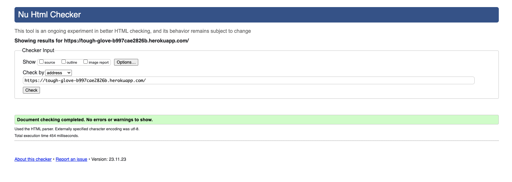
<details>
<summary>Pages Checked List:</summary>

- create_member.html
- delete_member.html
- login.html
- members.html
- profile.html
- register.html
- update_member.html
- book_classes.html
- cancel_booking.html
- classes.html
- delete_class.html
- update_class.html
- user_bookings.html
- admin_dashboard.html
- available_classes.html
- base.html (was checked on every instance of every other page with page source code inputted into the validator)
- homepage.html
- 400.html
- 403.html
- 404.html
- 500.html

</details>

### CSS

All CSS code was put through the [W3 CSS Validator](https://jigsaw.w3.org/css-validator/) and passed.
<br>

> style.css
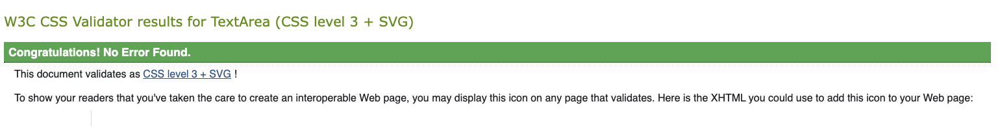
<details>
<summary>Pages Checked List:</summary>

- style.css
- homepage.css
- admin.css

</details>

### Python

All python code was put through the [Code Institute Python Linter](https://pep8ci.herokuapp.com/#) and passed

<br>

> forms.py
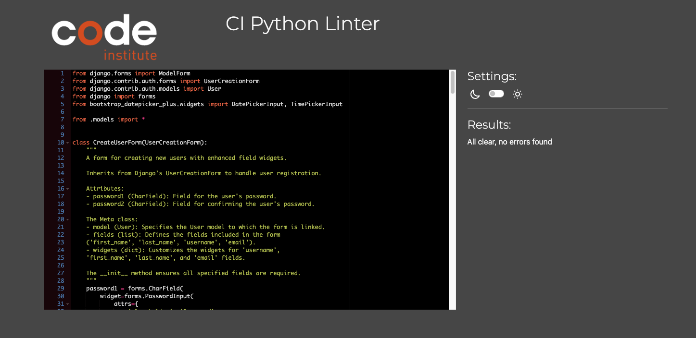

<details>
<summary>Pages Checked List:</summary>

- decorators.py
- forms.py
- models.py
- test_forms.py
- test_models.py
- test_views.py
- views.py


</details>

<br>

# Deployment

### ElephantSQL Database

> This project uses [ElephantSQL](https://www.elephantsql.com) for the PostgreSQL Database.

To obtain your own Postgres Database, sign-up with your GitHub account, then follow these steps:
- Click **Create New Instance**.
- Provide the name of your project e.g. `Tough-Glove`
- Select the **Tiny Turtle (Free)** plan.
- Choose your **Data Center** e.g. `eu-west-1 (Ireland)` 
- Click "Review"
- Once you have checked your details, click "Create Instance"
- Once created, click on the new database name, where you can view the database URL and Password.
 - On the details page of your Instance, copy the URL beginning with `postgres://` and Paste your ElephantSQL url in your env.py file
 - Make sure to include your URL in your Heroku app settings as outlined in the Heroku section below

### Cloudinary 

> This project uses the [Cloudinary API](cloudinary.com) to store static files

To set up a Cloudinary API follow these steps:
- Sign up or login to Cloudinary
- Your Cloudinary Dashboard provides access to your API Environment Variable, which you can copy.
- Important: Exclude 'CLOUDINARY_URL=' from the API value, as this represents the key
- Paste your Cloudinary url in your env.py file
- Make sure to include your URL in you Heroku app settings as outlined in the next section


### Heroku

> This project uses [Heroku](heroku.com)

To deploy to Heroku I followed these steps: 

- Sign up or login on Heroku
- Create a new app in Heroku by selecting "New" and "Create New App" from the admin dashboard homepage
- Choose your name e.g. `tough-glove` as the name for the project and chose your region e.g. `EU`
- Confirmed creation of a new app
- Navigate to the submenu in the navigation bar and select "resources"
- From here I was redirected to the Deploy tab
- Navigate to Settings and click the "Reveal Config Vars" button
- Create a new Key Value pair with the key of "CLOUDINARY_URL" and the value of the Cloudinary url in the .env file of the app repository
- Create a second Key Value pair with the key of "DATABASE_URL" and the value of the Elephant SQL url in the .env file of the app repository
- Create a third Key Value pair with a value of "SECRET_KEY" and the value of the SECRET_KEY variable in your .env file of the app repository
- Create one more Key Value pair with the value of PORT and a Key of 8000

| Key | Value |
| --- | --- |
| `CLOUDINARY_URL` | user's own value |
| `DATABASE_URL` | user's own value |
| `DISABLE_COLLECTSTATIC` | 1 (*this is temporary, and can be removed for the final deployment*) |
| `SECRET_KEY` | user's own value |
| `PORT` | 8000 |

- Heroku needs two additional files in order to deploy properly.
  - requirements.txt
  - Procfile

>You can install this project's requirements (where applicable) using:
>
>pip3 install -r requirements.txt
>If you have your own packages that have been installed, then the requirements file needs >updated using:

>pip3 freeze --local > requirements.txt
>The Procfile can be created with the following command:

>echo web: gunicorn app_name.wsgi > Procfile
>replace app_name with the name of your primary Django app name; the folder where settings.py is located

- In the Settings tab, ensure that the Python Buildpack is added.
- In the Deploy tab, enable automatic deploys from the Github repository
- Click "Deploy Branch" to deploy the app
- Once the app has been built, click "open app" in the top right corner to test deployment


### Local Deployment

#### Forking the repository

By forking the GitHub Repository you can make a copy of the original repository to view or change without it effecting the original repository.
You can do this by: 
-  Logging into GitHub or create an account. 
- Locate the repository at  [here](https://github.com/BOM-98/tough-glove-project-4)  . 
-  At the top of the repository, on the right side of the page, select "Fork" from the buttons available. 
-  A copy of the repository should now be created in your own repository.

#### Create a clone of this repository

Creating a clone enables you to make a copy of the repository at that point in time - this lets you run a copy of the project locally: This can be done by:

-   Navigate [Here](https://github.com/BOM-98/tough-glove-project-4)
-   click on the arrow on the green code button at the top of the list of files
-   select the clone by https option and copy the URL it provides to the clipboard
-   navigate to your code editor of choice and within the terminal change the directory to the location you want to clone the repository to.
-   type 'git clone' and paste the https link you copied from github
-   press enter and git will clone the repository to your local machine

#### Requirements

For local deployment, you will need to create a .env file in the root directory of the project and set the environment variables in this file.
You will need to define the following variables:

| Key | Value |
| --- | --- |
| `CLOUDINARY_URL` | user's own value |
| `DATABASE_URL` | user's own value |
| `SECRET_KEY` | user's own value |

<br>

# Credits

## Courses & Tutorials
- Denis Ivy Youtube tutorials were used to learn how to create a django project. Specifically, this Youtube Series was used to learn the ropes of Django - [Denis Ivy Youtube Series](https://www.youtube.com/watch?v=xv_bwpA_aEA&list=PL-51WBLyFTg2vW-_6XBoUpE7vpmoR3ztO)

- This Codecademy Skill Path was used to learn the ins and outs of Django concepts [Codecademy Course](https://www.codecademy.com/learn/paths/build-python-web-apps-with-django)

- Organising project boards - [Youtube video describing project boards](https://www.youtube.com/watch?v=C0RTISXqyAk)

## Articles & Guides

- [Setting up the project boards, issues and milestones](https://www.topcoder.com/thrive/articles/project-management-on-github)
- [Design and layout of the registration form](https://epicbootstrap.com/snippets/registration)
- [Design and layout of the members list page](https://www.bootdey.com/snippets/view/new-customer-list#css)
- [Datepicker](https://github.com/monim67/django-bootstrap-datepicker-plus/blob/master/README.rst#usage)
- [Django signals](https://docs.djangoproject.com/en/4.2/topics/signals/)
- Creating cancel buttons that don’t post [John Harbison's Blog](http://johnharbison.net/make-a-form-a-cancel-button)
- [Stack Overflow Discussion](https://stackoverflow.com/questions/17678689/how-to-add-a-cancel-button-to-deleteview-in-django)
- [Fullcalendar](https://www.jsdelivr.com/package/npm/fullcalendar)
- [Carousel](https://getbootstrap.com/docs/5.0/components/carousel/)
- [Setting fields to required](https://stackoverflow.com/questions/7682804/django-model-forms-setting-a-required-field)
- [Guide on creating docstrings](https://realpython.com/documenting-python-code/#documenting-your-python-code-base-using-docstrings)
- [Securing against unauthorized access](https://www.codu.co/articles/securing-django-views-from-unauthorized-access-npyb3to_)
- [Types of assertions](https://docs.python.org/3/library/unittest.html)
- [Testing specifically in Django](https://docs.djangoproject.com/en/4.2/topics/testing/)


## Code Examples & Templates
- [Custom 404](https://www.makeuseof.com/create-custom-404-error-page-django/): The template for 404 pages
- [Admin Dashboard](https://github.com/startbootstrap/startbootstrap-sb-admin-2): This codebase was used as inspiration and was heavily customized to suit the needs of this project

## Acknowledgements

- I would like to thank my Code Institute mentor, Lauren Nicole Poppich for her support throughout the development of this project and her invaluable advice.
- I would like to thank the Code Institute tutor team for their assistance with troubleshooting and debugging some project issues, particularly rotating the keys of my database and cloudinary account.
